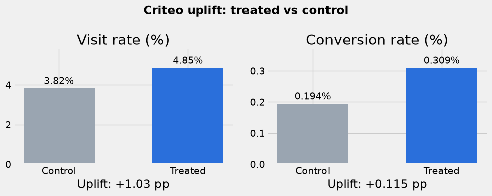
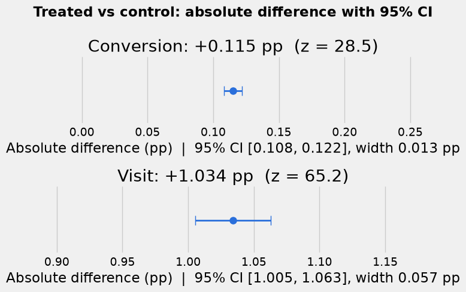
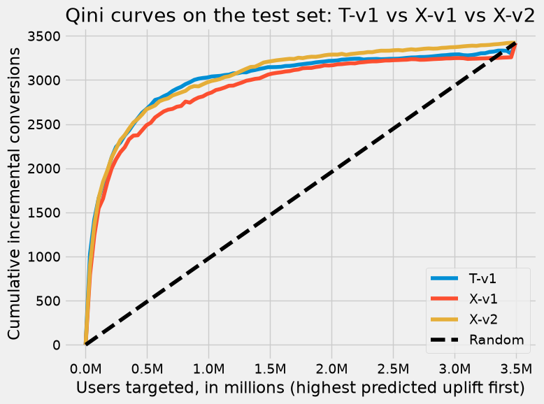
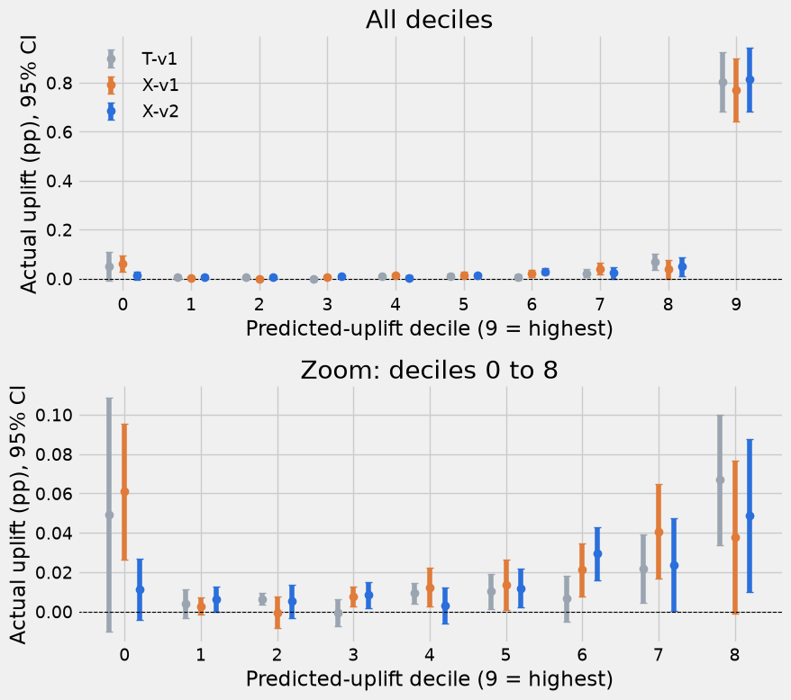

# Marketing Uplift Modeling (Criteo dataset)

**Question:** Which users should we show the ad to, so that the ad actually causes extra conversions?

Uplift = conversion rate of users who saw the ad − conversion rate of users who did not.

**Data:** Criteo Uplift dataset (search "Criteo uplift" on Kaggle) · 13.98M users · 12 anonymous features · ~85% treated / 15% control · conversion ~0.29%.
Download it and put the CSV in a `data/` folder (not included here).

## Flow

1. **EDA:** nulls, correlations, group balance, feature structure.
2. **Z-test:** does the ad work at all?
3. **Split:** train / validation / test (60 / 15 / 25), stratified on treatment × conversion.
4. **Models (XGBoost via** `causalml`**):** T-learner (T-v1) and X-learner (X-v1, X-v2).
5. **Evaluate:** Qini score, Qini curves, decile tables with confidence intervals, bootstrap comparison.
6. **Business cutoff:** how many users to target.

## Results

**1. The ad works on average**

- Conversion: 0.194% (control) → 0.309% (treated), **+0.115 pp** (95% CI 0.108 to 0.122), about +59% relative.
- Visit: 3.82% → 4.85%, **+1.034 pp** (95% CI 1.005 to 1.063).
- p < 0.001 for both.

**2. Groups are balanced**

- Largest standardized difference between treated and control is 0.049, well below 0.1.
- Small catch: treated users are slightly more likely to have non-common feature values, which lifts the raw uplift a little. Adjusted for the f4 groups it is **+0.107 pp** instead of +0.115 pp.

**3. A small group drives the effect**

- Most features are near-constant: one value is shared by 90%+ of users, plus a small tail of other values.
- The f4 tail is about 4% of users but gives about 73% of all conversions. Its uplift is **+1.55 pp**, against +0.04 pp for everyone else.

**4. Models find the right users**

- Qini score on test: T-v1 **0.38**, X-v1 **0.35**, X-v2 **0.39**.
- The top 10% of users ranked by predicted uplift really have about **+0.8 pp** extra conversions.

**5. Model comparison**

- Bootstrap (500 resamples): X-v2 is slightly better than X-v1.
- No clear winner between X-v2 and T-v1.
- X-v2 is the most stable, so it is used for the cutoff.

**6. Who to target (X-v2, test set)**

| Targeted | Users   | Incremental conversions | Share of total benefit |
| -------- | ------- | ----------------------- | ---------------------- |
| Top 10%  | 349,489 | 2,452                   | 72%                    |
| Top 20%  | 698,979 | 2,827                   | 83%                    |

- Each further 10% adds only about 165–375 conversions.
- **Start with the top 20%.** The final cutoff depends on the ad cost and the value of a conversion, which are not in the data. Next step: pick the cutoff with those, then confirm it with a follow-up experiment that shows the ad only to the top-ranked users.

## Run it

- Python, `pandas`, `statsmodels`, `matplotlib`, `xgboost`, `causalml`
- Versions used (pinned in the notebook's first cell): `causalml` 0.17.0, `xgboost` 3.4.1, `scikit-learn` 1.9.0. Other versions can give different T-learner results.
- On Mac: `brew install libomp` (needed by XGBoost), then restart the kernel.
- Open `marketing_uplift_modelling.ipynb` and run all cells.

